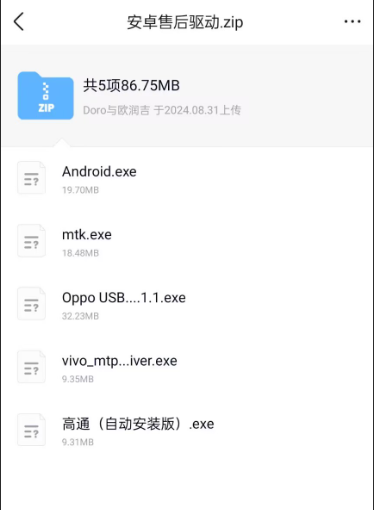
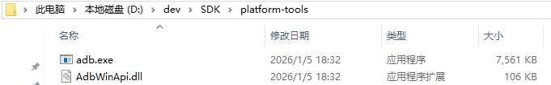
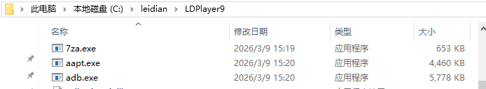
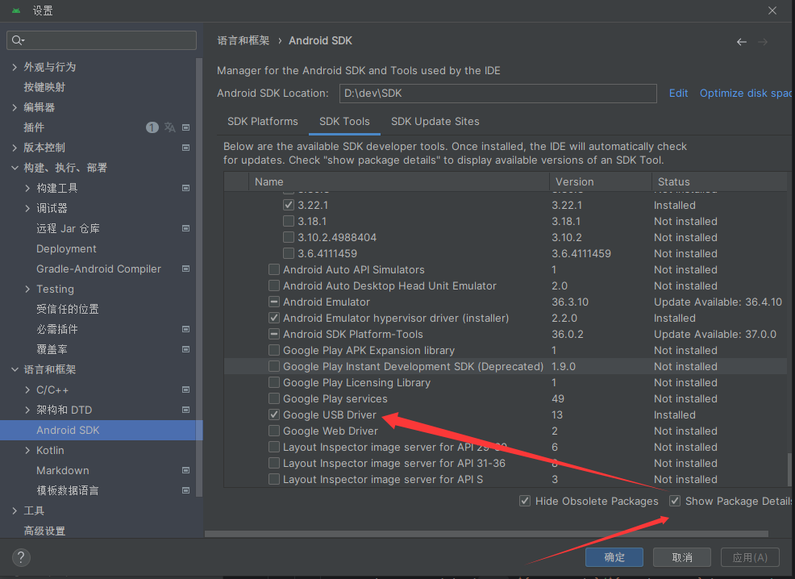
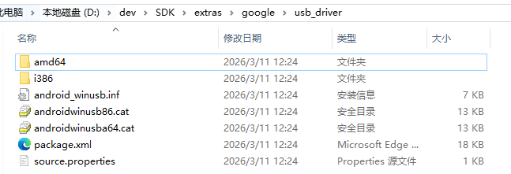
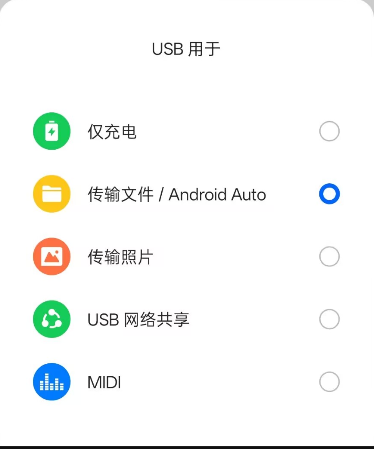
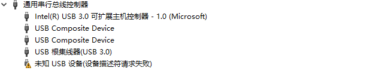
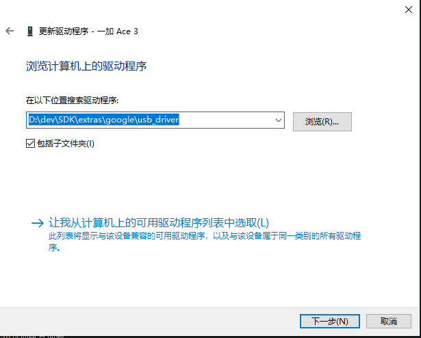

# 一、有关刷机和ADB无法连接的疑难杂症

Tips：
本人是25年9月份接触到刷机的,当时什么也不会,所以跑了很多次线下拜托别人刷机,其中就包括重庆和南京.\n
在一个城市的手机城能刷操作系统的人不少,但是会刷root的就两三个,有的甚至拒绝给你刷,毕竟这是风险大且吃力不讨好的活.\n
本人在多次碰壁后,总结了各种问题，所以有了这篇文章.

## 本人机型:一加ACE3

## 驱动问题
本人进了个刷机群,经常听见群友讨论.ADB连接不上就装驱动试试,然而发过来的图片又如下所示,各种文件千奇百怪,\n
而且每次发过来的驱动还不一样,有时候又让你用软件装,所以要连接ADB装的驱动究竟是指什么？\n

### 驱动分为两种,一种是USB驱动,一种是ADB驱动
ADB驱动是使用ADB命令必装的驱动,主流的ADB驱动就三种:\n
1.Android Studio自带的ADB驱动：
\n
这个一般是开发者使用的官方驱动.
2.模拟器自带的驱动,这里以雷电模拟器为例子:
\n
3.就是大佬魔改的驱动:
例如说残芯ADB

USB驱动是为了让你设备被电脑识别装的驱动\n
USB驱动分两种:\n
1.Android Studio自带的USB驱动:\n

下载好了的USB驱动在这个目录下:\n

这个是谷歌官方的USB驱动主要用来适配谷歌的机型\n
2.各大手机厂家自己的USB驱动：\n
如果你发现谷歌官方的USB驱动适配不了你的机型,那说明厂家魔改了自己的操作系统\n
这个时候你就要下载对应机型的USB驱动,比如说下面👇这个就是OPPO的USB驱动\n

## 系统设置问题
解BL锁🔒之前一定要开启OEM,还有关闭系统自动更新!!!\n
本人就是没关自动更新,root效果直接失效了\n
悠悠苍天！何薄于我？😭😭😭\n

## USB选项配置问题
在系统成功识别设备后,会让你选择USB选项配置：

这里也是坑了我好久,平常的设备选择文件传输才可以连接上ADB\n
而一加和华为的机型要选择仅充电才可以连接上ADB\n
踩坑了好久.我直接破防了.\n
华为这个机型选择仅充电我没有尝试过,是线下给我刷机的大佬给我说的.\n

## 系统识别不到设备
win+x打开设备管理器,如果发现下图所示,说明你的设备没有被系统识别.\n

首先检查你的USB线,如果你的线是两芯的,没有数据传输功能,你插上线之后就不会弹出USB选项配置窗口\n
如果不是线的问题,就可以尝试更新驱动了\n

## fastboot问题
这是fastboot刷镜像的命令：fastboot flash boot Masik修补过的.img\n
可怎么刷都没有成功得到ROOT权限\n
在线下大佬通过遍历扫描手机的全文件才知道,一加把这boot分区重命名了\n
你需要刷fastboot flash init_boot Masik修补过的.img才能ROOT\n
我直接破大防了,你现在看的都是我一步一步踩进去的坑.

## 熔断机制
看到文章最后,我相信你是真心想要刷机了,最后提醒一下\n
在刷机之前一定要备份好重要数据,看看最新的公告\n
注意一下手机厂商有没有发布出有关刷机或退版本熔断的消息\n
刷机顺利 GOOD LUCK

## Star History

<a href="https://star-history.com/#zzyo527zzyo/-&Date">
  <picture>
    <source media="(prefers-color-scheme: dark)" srcset="https://api.star-history.com/svg?repos=zzyo527zzyo/-&type=Date&theme=dark" />
    <source media="(prefers-color-scheme: light)" srcset="https://api.star-history.com/svg?repos=zzyo527zzyo/-&type=Date" />
    
  </picture>
</a>